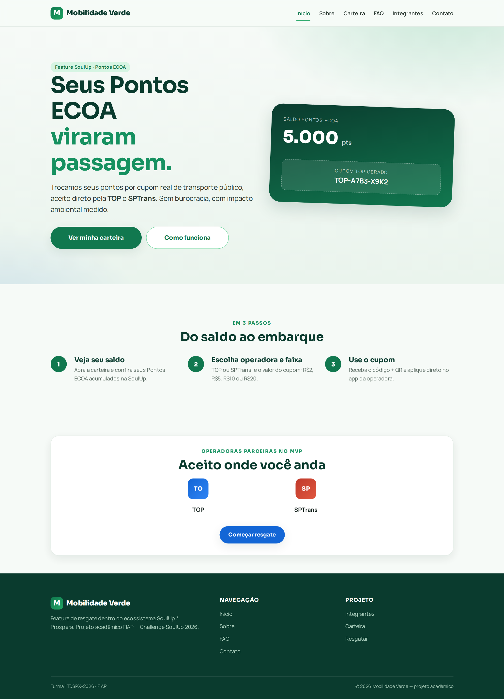
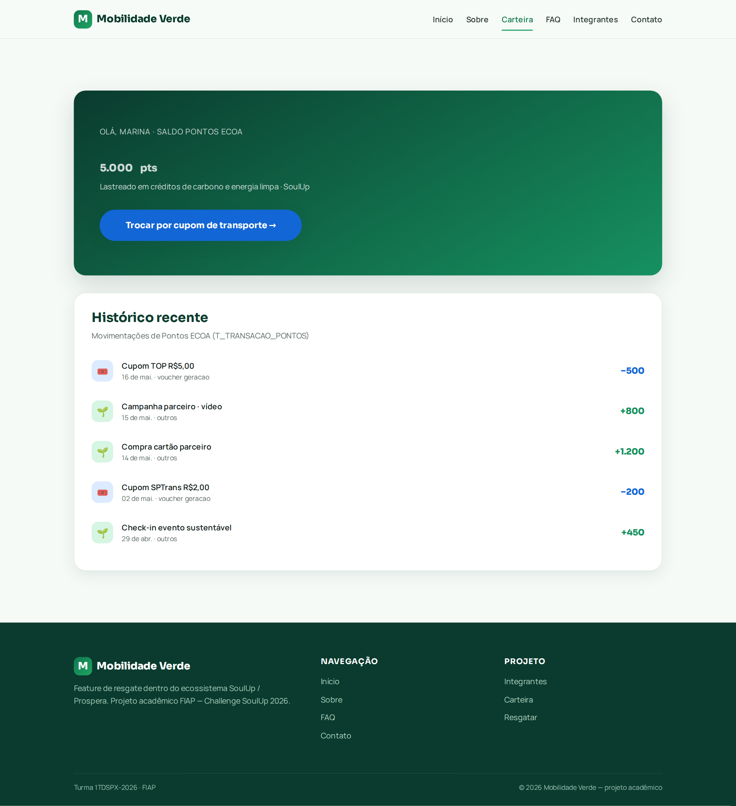
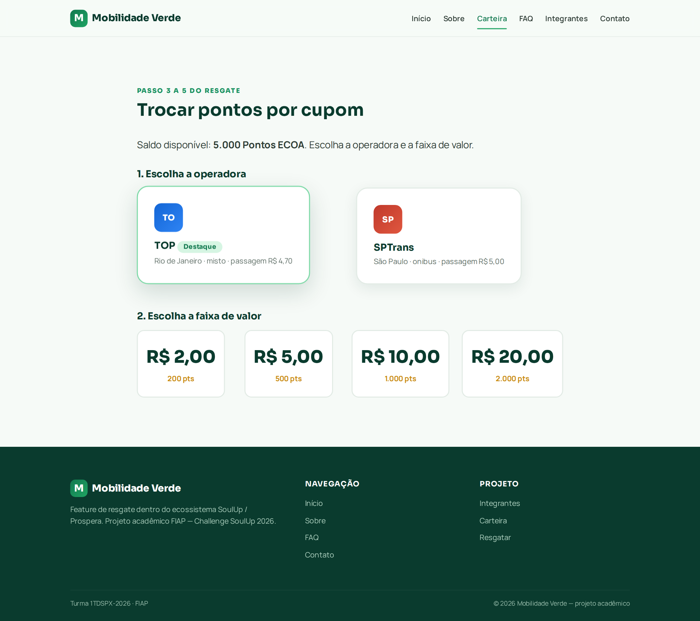
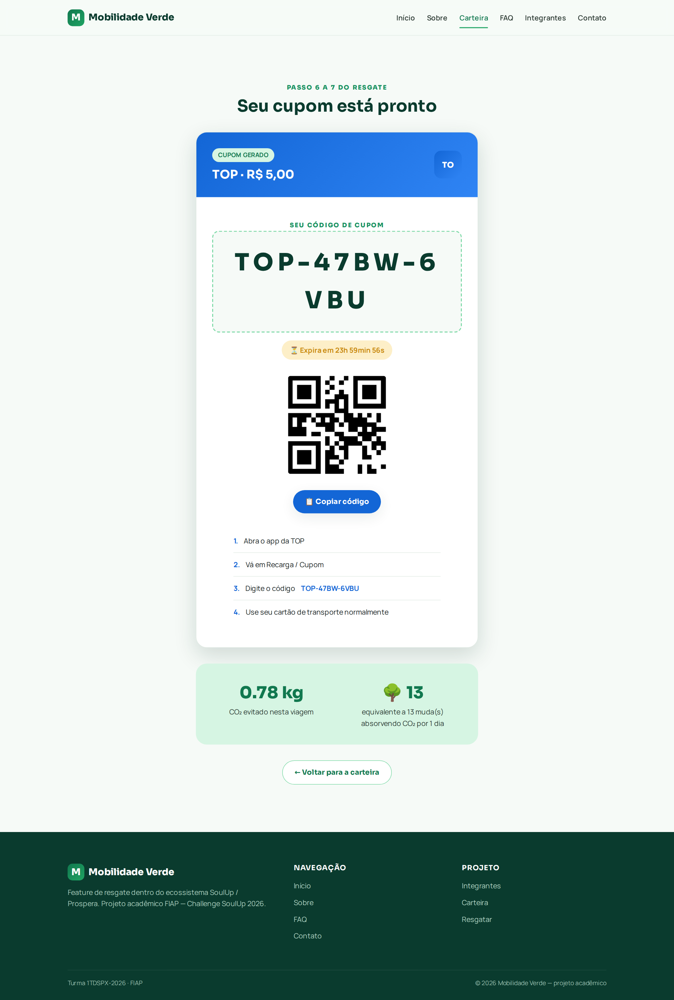
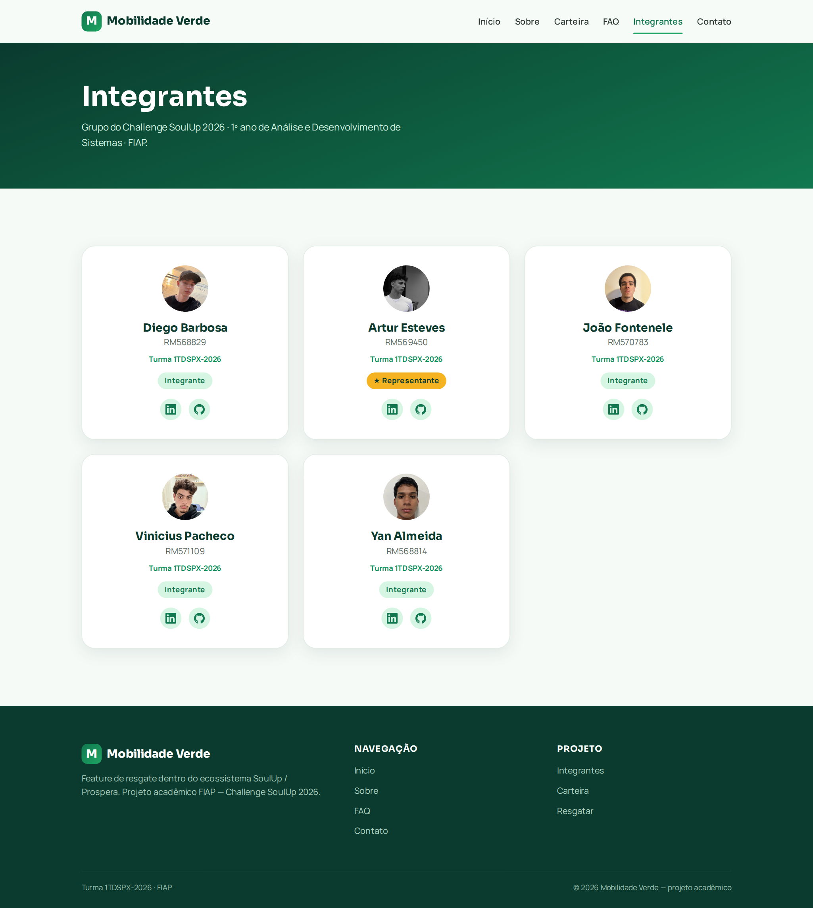
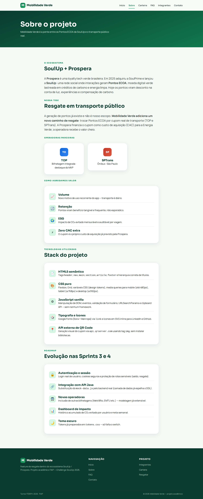

# 🌱 Mobilidade Verde

> **Seus Pontos ECOA viraram passagem.**
> Feature de **resgate** dentro do ecossistema SoulUp / Prospera: troca de Pontos ECOA por cupom real de transporte público (TOP e SPTrans).

Projeto acadêmico desenvolvido para o **Challenge SoulUp 2026** — FIAP, 1º ano de Análise e Desenvolvimento de Sistemas.

🔗 **Repositório público:** https://github.com/EstevesArtur/mobilidade-verde-front

---

## 👥 Integrantes — Turma 1TDSPX-2026

| Nome | RM | Papel | LinkedIn | GitHub |
|---|---|---|---|---|
| Diego Barbosa | RM568829 | Integrante | [@diego-barbosa-rodrigues](https://www.linkedin.com/in/diego-barbosa-rodrigues-a60677321) | [@DiegoRodri1](https://github.com/DiegoRodri1) |
| **Artur Esteves** | **RM569450** | **★ Representante** | [@artur-esteves](https://www.linkedin.com/in/artur-esteves-31bb4130a/) | [@EstevesArtur](https://github.com/EstevesArtur) |
| João Fontenele | RM570783 | Integrante | [@joão-fontenele](https://www.linkedin.com/in/jo%C3%A3o-fontenele-65b1913a8/) | [@joaofontenele06](https://github.com/joaofontenele06) |
| Vinicius Pacheco | RM571109 | Integrante | [@vinicius-pacheco-ruiz](https://www.linkedin.com/in/vinicius-pacheco-ruiz-66026033b/) | [@viniciuspr27](https://github.com/viniciuspr27) |
| Yan Almeida | RM568814 | Integrante | [@yan-almeida-cardoso](https://br.linkedin.com/in/yan-de-almeida-cardoso-2210372ba) | [@YanAlmeidaC](https://github.com/YanAlmeidaC) |

---

## 🎯 Tese central

A geração de Pontos ECOA já existe na SoulUp e **não é nosso escopo**. A Mobilidade Verde
adiciona um **novo caminho de resgate**: o usuário converte seus pontos em cupom real de
transporte público. A Prospera financia o cupom como custo de aquisição (CAC) para a
Energia Verde; a operadora recebe o valor cheio. O impacto de CO₂ evitado é mensurável
e auditável por viagem.

Caminho desenhado pelo front:

```
carteira.html  →  resgatar.html  →  cupom.html
(ver saldo)       (operadora+faixa)  (código + QR + impacto)
```

Conversão Pontos ECOA → Real (por faixa fixa):

| Faixa | Pontos ECOA |
|---|---|
| R$ 2,00 | 200 pts |
| R$ 5,00 | 500 pts |
| R$ 10,00 | 1.000 pts |
| R$ 20,00 | 2.000 pts |

---

## 🖼️ Prints do projeto

### Página inicial


### Carteira (saldo + histórico)


### Resgate (operadora + faixa)


### Cupom (tela-estrela)


### Integrantes


### Sobre


---

## 🗂️ Estrutura de pastas

```
mobilidade-verde-front/
├── index.html            # Hero + 3 passos + credibilidade
├── sobre.html            # Contexto + tese + tecnologias + roadmap
├── integrantes.html      # 5 cards (nome, foto, RM, turma, LinkedIn, GitHub)
├── faq.html              # 8 perguntas em acordeão acessível
├── contato.html          # Formulário validado + espaço do chatbot
├── carteira.html         # Saldo ECOA + histórico (Passo 1-2)
├── resgatar.html         # Operadora + faixa + confirmação (Passo 3-5)
├── cupom.html            # Código + QR + validade + impacto (Passo 6-7)
├── css/
│   ├── reset.css         # Normalização e foco acessível
│   ├── tokens.css        # Design tokens (paleta SoulUp + tipografia)
│   ├── layout.css        # Grid, header sticky, footer, breakpoints
│   ├── components.css    # Botões, cards, cupom, carteira, formulário
│   └── utilities.css     # Classes utilitárias (espaçamento, cor, tipografia)
├── js/
│   ├── mock-data.js      # Dados espelhando o DDL do banco
│   ├── main.js           # Nav mobile, acordeão FAQ, validação, reveal
│   ├── carteira.js       # Renderiza saldo + histórico de transações
│   ├── resgatar.js       # Fluxo operadora → faixa → cupom
│   └── cupom.js          # Código, QR via API, contagem regressiva, CO₂
├── img/
│   ├── integrantes/      # Fotos dos 5 integrantes
│   ├── screenshots/      # Prints das telas (referenciados aqui)
│   ├── top.svg           # Logo mockado TOP
│   └── sptrans.svg       # Logo mockado SPTrans
└── README.md
```

---

## ▶️ Como rodar

Não há build nem dependências. Basta:

```bash
git clone https://github.com/EstevesArtur/mobilidade-verde-front.git
cd mobilidade-verde-front
# abrir index.html no navegador
```

> Dica: para testar a navegação por querystring (`cupom.html`), sirva localmente:
> `python3 -m http.server 8080` e acesse `http://localhost:8080`.

---

## 🛠️ Tecnologias utilizadas

- **HTML5** semântico (`<header>`, `<nav>`, `<main>`, `<section>`, `<article>`, `<footer>`)
- **CSS3** puro (Flexbox, Grid, variáveis CSS, media queries para mobile/tablet/desktop)
- **JavaScript** vanilla (manipulação de DOM, eventos, `URLSearchParams`, Clipboard API)
- **Google Fonts** via `<link>` (Sora + Manrope)
- **API externa de QR Code** via `` (`api.qrserver.com`)
- **Ícones SVG inline** (LinkedIn e GitHub, sem dependências externas)

### ⚠️ ZERO framework usado

Não há React, Vue, Angular, Bootstrap, Tailwind, jQuery, Sass ou qualquer
biblioteca de terceiros. Todo o CSS e JS é autoral e pode ser auditado
arquivo por arquivo.

---

## 📱 Responsividade

Breakpoints alinhados com a rubrica oficial do Challenge:

- **Mobile:** até 480px — layout em coluna única, menu hambúrguer
- **Tablet:** ≥ 768px — grids de 2 colunas, espaçamento intermediário
- **Desktop:** ≥ 992px — layout completo com 3-4 colunas

---

## 🎨 Identidade visual

Paleta ancorada na marca real **SoulUp / Prospera**:

- **Verde Soul** — núcleo da marca sustentável (CTAs, marca)
- **Âmbar ECOA** — moeda Pontos ECOA / Selo Verde (saldo, valores)
- **Azul-trânsito** — única cor de inovação, escopo restrito à camada de
  transporte (operadoras, trilha de resgate, cupom)

Tipografia: **Sora** (display) + **Manrope** (corpo).

---

## 🔗 Integração com o restante do produto

`mock-data.js` espelha os nomes de campo do DDL
(`mobilidade_verde_ddl.sql`) — `id_usuario`, `saldo_pontos`, `id_operadora`,
`valor_centavos`, `pontos_necessarios`, `codigo`, `status`, `expira_em` etc.
Isso prepara o front para consumir a API real (Java) nas Sprints 3-4 sem
reescrever a camada de dados.

---

## 🚀 Roadmap (Sprints 3-4)

- Consumo de API real (Java) substituindo `mock-data.js`
- Autenticação de usuário e sessão
- Novas operadoras (modelagem já extensível)
- Histórico de viagens e dashboard de impacto acumulado
- Tema escuro (tokens já preparados em `tokens.css`)

---

## 📞 Contato

Dúvidas, suporte ou propostas? Fale com o líder do grupo:

- **E-mail:** Arturbianchini21@gmail.com
- **Telefone / WhatsApp:** (11) 99551-1888
- **Issues no GitHub:** https://github.com/EstevesArtur/mobilidade-verde-front/issues

---

© 2026 Mobilidade Verde — Turma 1TDSPX-2026 · FIAP · projeto acadêmico.
