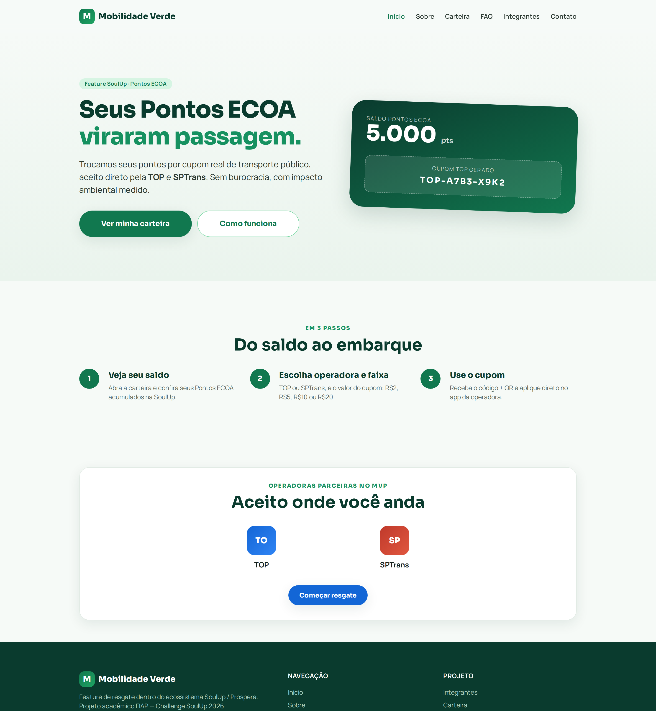
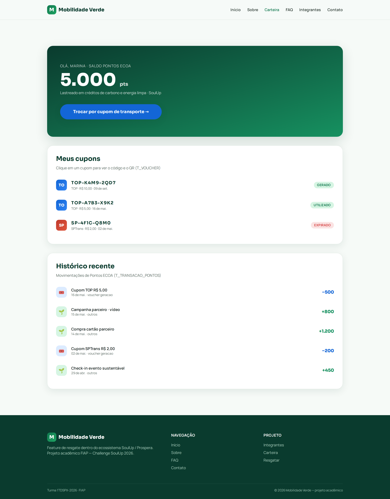
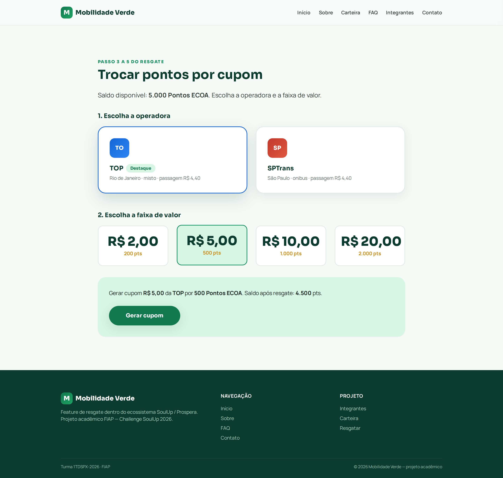
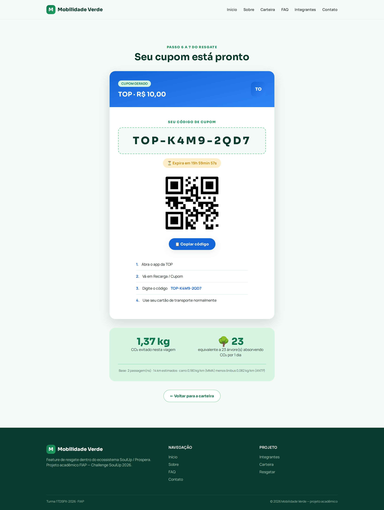
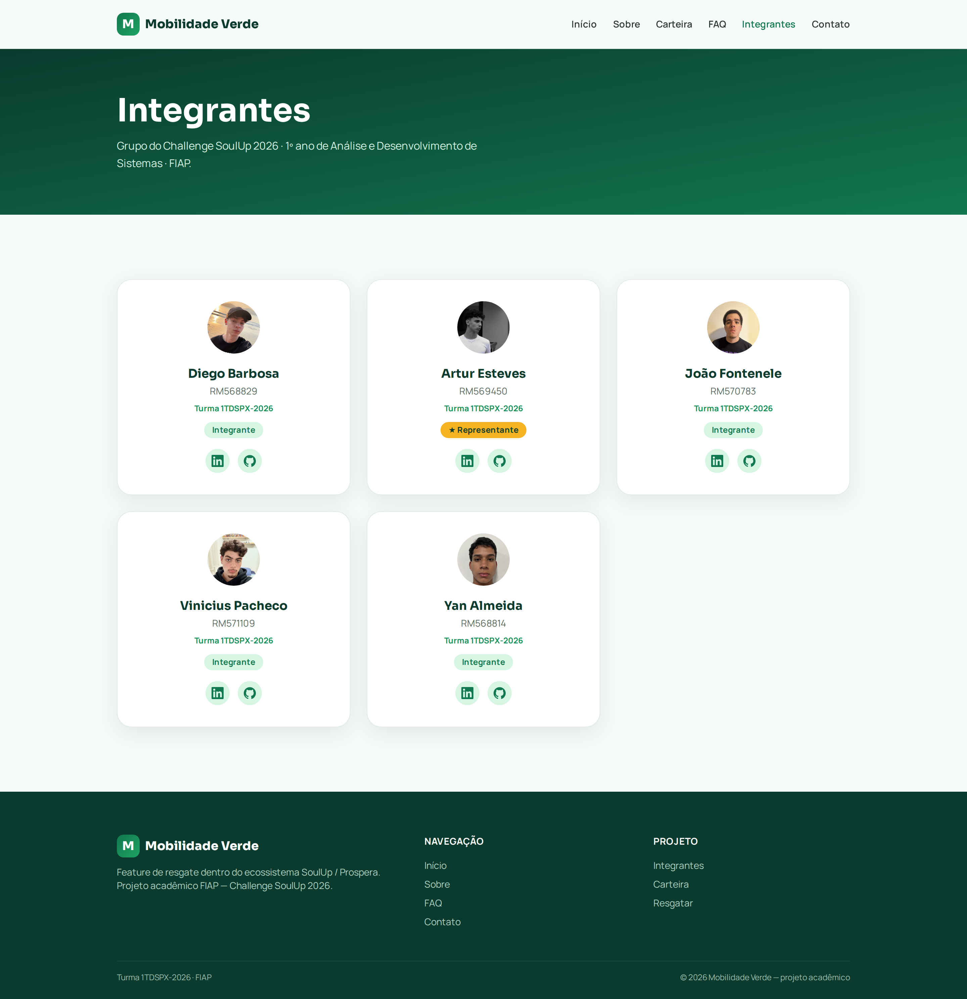
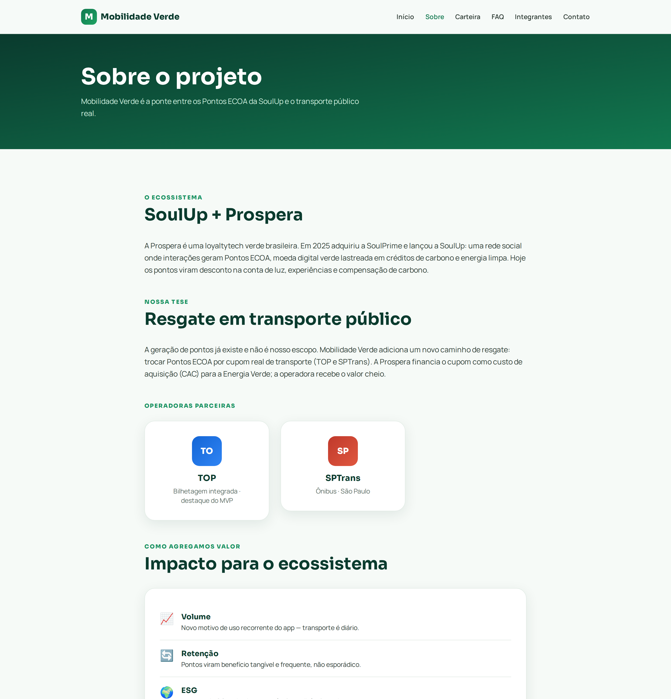
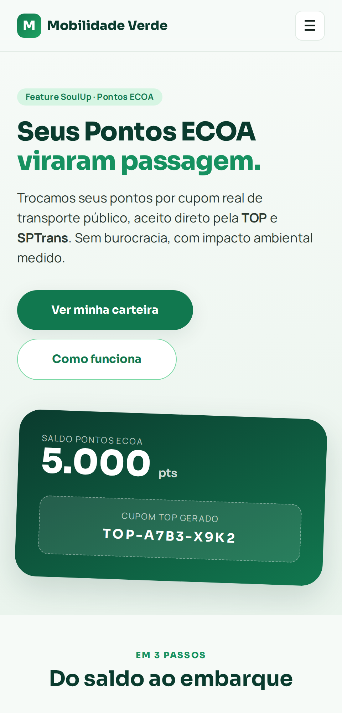

# 🌱 Mobilidade Verde

**Troque seus Pontos ECOA por cupom real de transporte público.**

Mobilidade Verde é uma feature dentro da **SoulUp** (grupo Prospera), rede social e programa de fidelidade onde o usuário acumula **Pontos ECOA** — moeda digital verde lastreada em créditos de carbono e energia limpa.

A geração de pontos já existe na plataforma e está fora do nosso escopo. O que este projeto entrega é o **caminho de resgate**: transformar Pontos ECOA em cupom de transporte público aceito pelas operadoras parceiras, **TOP** e **SPTrans**.

O usuário abre a carteira, vê o saldo, escolhe a operadora e a faixa de valor, e recebe na hora um cupom com código único, QR Code e validade de 24 horas — junto com o cálculo de quanto CO₂ aquela viagem deixa de emitir.

> **Challenge SoulUp 2026 · FIAP · Sprint 3 · Front-End Design Engineering**
> Turma **1TDSPX-2026** — 1º ano de Análise e Desenvolvimento de Sistemas

**🎥 Vídeo de demonstração:** https://youtu.be/l_q2khj1rLI
**📦 Repositório:** https://github.com/EstevesArtur/mobilidade-verde-front

---

## 📸 O projeto

### Home


### Carteira — saldo, cupons e histórico


### Resgate — escolha de operadora e faixa


### Cupom — código, QR e impacto ambiental


### Integrantes


### Sobre


### Responsividade — 480px


---

## 🛠️ Tecnologias utilizadas

| Tecnologia | Versão | Papel no projeto |
|---|---|---|
| **React** | 19.2 | Biblioteca de interface, componentes funcionais e hooks |
| **Vite** | 8.2 | Build e servidor de desenvolvimento |
| **TypeScript** | 6.0 | Tipagem estática de componentes, props e dados |
| **TailwindCSS** | 4.3 | Estilização por classes utilitárias, sem CSS externo |
| **React Router DOM** | 7.18 | SPA com layout compartilhado, rotas estáticas e dinâmicas |
| **React Hook Form** | 7.87 | Formulário de contato com validação e tipagem |
| **Google Fonts** | — | Sora (títulos) e Manrope (corpo) |
| **API QR Server** | — | Geração do QR Code do cupom, via tag `img` |

**Hooks utilizados:** `useState`, `useEffect`, `useParams`, `useNavigate`, `useLocation`.

**Sem bibliotecas de UI e sem cliente HTTP externo.** Nenhum Bootstrap, Material UI ou Axios. Toda a identidade visual é construída com classes Tailwind sobre os tokens da paleta SoulUp.

### Identidade visual

| Camada | Cor | Uso |
|---|---|---|
| Verde Soul | `#0A3B2E` → `#D6F5E3` | marca, superfícies, textos |
| Âmbar ECOA | `#C98A0E` → `#FDEFC8` | pontos, valores, destaques |
| Azul-trânsito | `#1366D6` → `#DCEBFF` | exclusivo da camada de transporte |

Os tokens de cor, as fontes e os breakpoints são declarados no bloco `@theme` do `src/index.css`, o arquivo de entrada oficial do Tailwind v4.

### Responsividade

Os breakpoints do tema foram redefinidos para corresponder exatamente aos exigidos no projeto:

| Faixa | Prefixo Tailwind | Largura |
|---|---|---|
| Mobile | *(padrão)* | até 480px |
| Tablet | `md:` | 768px |
| Desktop | `lg:` | 992px ou mais |

---

## 📁 Estrutura de pastas

mobilidade-verde-front/
├── public/
│ └── img/
│ ├── integrantes/ # fotos dos 5 integrantes
│ ├── screenshots/ # capturas usadas neste README
│ ├── top.svg
│ └── sptrans.svg
├── src/
│ ├── components/
│ │ ├── layout/ # Header, Footer, Layout
│ │ ├── ui/ # Botao, Card, Badge, Secao, CampoErro...
│ │ └── mobilidade/ # componentes de domínio do resgate
│ ├── pages/ # uma página por rota
│ ├── data/ # conteúdo e dados simulados
│ ├── types/ # interfaces espelhando o modelo do banco
│ ├── services/ # acesso aos dados (vira API na Sprint 4)
│ ├── utils/ # formatação e cálculo de CO₂
│ ├── App.tsx # declaração de todas as rotas
│ ├── main.tsx # ponto de entrada
│ └── index.css # ÚNICO arquivo CSS: entrypoint do Tailwind
├── index.html
├── package.json
├── tsconfig.json
├── vite.config.ts
└── README.md


### Rotas

| Rota | Página | Tipo |
|---|---|---|
| `/` | Home | estática |
| `/sobre` | Sobre | estática |
| `/integrantes` | Integrantes | estática |
| `/faq` | Perguntas frequentes | estática |
| `/contato` | Contato | estática |
| `/carteira` | Carteira ECOA | estática |
| `/resgatar` | Resgate de cupom | estática |
| `/cupom/:codigo` | Cupom | **dinâmica** |
| `/operadoras/:idOperadora` | Detalhe da operadora | **dinâmica** |
| `*` | Página não encontrada | fallback |

### Coerência com o modelo de dados

As interfaces em `src/types/` espelham as tabelas do modelo relacional do grupo. As constraints `CHECK` do banco viraram *union types* no TypeScript:

```ts
type StatusVoucher = "GERADO" | "UTILIZADO" | "EXPIRADO" | "CANCELADO";
type Modal = "ONIBUS" | "METRO" | "TREM" | "MISTO" | "BRT";
```

Campos sensíveis do banco — `hash_senha`, `cpf_hash`, `hash_validacao` e `ip_origem` — **não são expostos no front-end** por decisão de segurança.

### Cálculo de impacto ambiental

O CO₂ evitado é a diferença entre o que o carro emitiria e o que o ônibus emite:

CO₂ evitado = km × (0,180 do carro − 0,082 do ônibus)


Fontes: **0,180 kg/km** para automóvel (MMA) e **0,082 kg/km** para ônibus urbano (ANTP). A equivalência em árvores usa a absorção média de **21,77 kg de CO₂ por ano**.

---

## 👥 Autores

Equipe **FOG** · Turma **1TDSPX-2026** · FIAP · 1º ano de Análise e Desenvolvimento de Sistemas

<table>
  <tr>
    <td align="center" width="20%">
      <br>
      <b>Diego Barbosa</b><br>
      RM568829<br>
      <sub>1TDSPX-2026</sub><br>
      <sub>Banco de Dados</sub><br><br>
      <a href="https://www.linkedin.com/in/diego-barbosa-rodrigues-a60677321">LinkedIn</a> ·
      <a href="https://github.com/DiegoRodri1">GitHub</a>
    </td>
    <td align="center" width="20%">
      <br>
      <b>Artur Esteves</b> ⭐<br>
      RM569450<br>
      <sub>1TDSPX-2026</sub><br>
      <sub>Front-End · <b>Representante</b></sub><br><br>
      <a href="https://www.linkedin.com/in/artur-esteves-31bb4130a/">LinkedIn</a> ·
      <a href="https://github.com/EstevesArtur">GitHub</a>
    </td>
    <td align="center" width="20%">
      <br>
      <b>João Fontenele</b><br>
      RM570783<br>
      <sub>1TDSPX-2026</sub><br>
      <sub>Java</sub><br><br>
      <a href="https://www.linkedin.com/in/jo%C3%A3o-fontenele-65b1913a8/">LinkedIn</a> ·
      <a href="https://github.com/joaofontenele06">GitHub</a>
    </td>
    <td align="center" width="20%">
      <br>
      <b>Vinicius Pacheco</b><br>
      RM571109<br>
      <sub>1TDSPX-2026</sub><br>
      <sub>Python</sub><br><br>
      <a href="https://www.linkedin.com/in/vinicius-pacheco-ruiz-66026033b/">LinkedIn</a> ·
      <a href="https://github.com/viniciuspr27">GitHub</a>
    </td>
    <td align="center" width="20%">
      <br>
      <b>Yan Almeida</b><br>
      RM568814<br>
      <sub>1TDSPX-2026</sub><br>
      <sub>IA & Chatbot</sub><br><br>
      <a href="https://br.linkedin.com/in/yan-de-almeida-cardoso-2210372ba">LinkedIn</a> ·
      <a href="https://github.com/YanAlmeidaC">GitHub</a>
    </td>
  </tr>
</table>

⭐ **Artur Esteves — RM569450 — Representante do grupo**

---

## 🚀 Como usar

**Repositório:** https://github.com/EstevesArtur/mobilidade-verde-front
**Vídeo de demonstração no YouTube:** https://youtu.be/l_q2khj1rLI

### Pré-requisitos

- **Node.js 20.19 ou superior** (verifique com `node -v`)
- npm (instalado junto com o Node)

### Rodando localmente

```bash
git clone https://github.com/EstevesArtur/mobilidade-verde-front.git
cd mobilidade-verde-front
npm install
npm run dev
```

Acesse **http://localhost:5173**.

### Scripts disponíveis

| Comando | O que faz |
|---|---|
| `npm run dev` | servidor de desenvolvimento com recarregamento automático |
| `npm run build` | verifica os tipos e gera a versão de produção em `dist/` |
| `npm run preview` | serve localmente a versão de produção |
| `npm run lint` | análise estática do código |

### Roteiro de navegação sugerido

1. **Home** — a proposta e os 3 passos do resgate
2. **Carteira** — saldo, cupons nos três status e histórico de transações
3. Clique em um cupom → abre a **rota dinâmica** `/cupom/:codigo`
4. **Resgatar** — escolha operadora e faixa, e gere um cupom novo
5. **Cupom** — código, QR, contagem regressiva de 24h e impacto de CO₂
6. **Contato** — envie o formulário vazio para ver as validações
7. Reduza a janela para **480px** e veja o menu virar hambúrguer

---

## 📞 Contato

Dúvidas, suporte ou propostas? Fale com o representante do grupo:

- **Nome:** Artur Esteves — RM569450 — Turma 1TDSPX-2026
- **E-mail:** Arturbianchini21@gmail.com
- **Telefone:** (11) 99551-1888
- **LinkedIn:** https://www.linkedin.com/in/artur-esteves-31bb4130a/
- **GitHub:** https://github.com/EstevesArtur
- **Issues do projeto:** https://github.com/EstevesArtur/mobilidade-verde-front/issues

---

<sub>Projeto acadêmico desenvolvido para o Challenge SoulUp 2026 — FIAP · Turma 1TDSPX-2026 · Sprint 3 · Front-End Design Engineering</sub>
